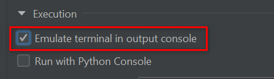

# useful Полезности, тесты, эксперименты

- **progress_bar.py** простой однострочный прогресс-бар с параметрыми
- **colorama_test.py** Тест цвета и позиции курсора
- **rich_test.py** При устанвке Emulate terminal нормально отображается прогресс-бар в Pycharm, но не выводятся символы юникода. И наоборот. 
   В новом терминале Windows (PowerShell и cmd) отображается все корректно
    
  - Console - с выводом символов юникода по символическим именам
  - track - красивый прогресс-бар
  
